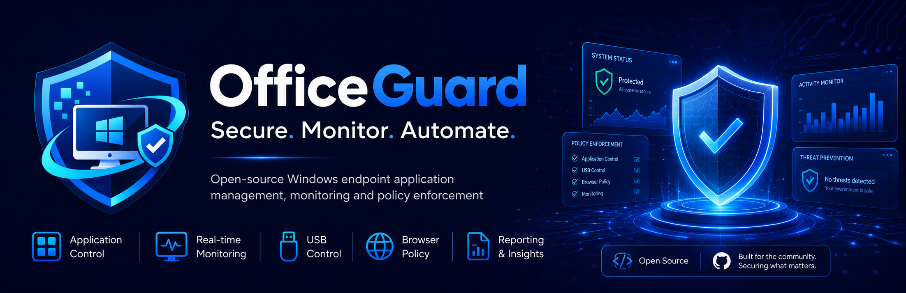

<h1 align="center">Eren Koyuncu</h1>

  <strong>Software Developer</strong> 
  Backend • Automation • Windows Systems • Integrations • Open Source

  
  
  

---

## About

I build practical software focused on backend systems, automation, integrations, business workflows and system-level tooling.

My work usually sits where application development meets real operational problems: structured-data engines, CRM-style systems, service integrations, workflow automation, endpoint utilities and deployment tooling.

I prefer building complete, maintainable products over isolated demos — from application logic and database design to security boundaries, packaging, CI, documentation and release workflows.

## Tech

  
  
  
  
  
  
  
  
  
  
  

# Featured Projects

## SchemaWeave Ecosystem

### [SchemaWeave](https://github.com/erenkoyuncu/SchemaWeave)

Open-source **Schema.org JSON-LD plugin for WordPress and WooCommerce**.

SchemaWeave generates structured data from real WordPress and WooCommerce data, with support for Organization, WebSite, LocalBusiness, WebPage variants, BlogPosting, Product, Offer/AggregateOffer, BreadcrumbList, ItemList and FAQPage. It includes per-content controls, visible FAQ safeguards, diagnostics, settings import/export and WP-CLI tooling.

**Stack:** PHP • WordPress • WooCommerce • Schema.org • JSON-LD • GitHub Actions

[WordPress Repository](https://github.com/erenkoyuncu/SchemaWeave) · [PHP Core](https://github.com/erenkoyuncu/SchemaWeave-PHP)

### [SchemaWeave-PHP](https://github.com/erenkoyuncu/SchemaWeave-PHP)

Framework-agnostic PHP 7.4+ core behind SchemaWeave, built around replaceable data-provider, URL-resolver and schema-extension contracts.

**Stack:** PHP 7.4+ • PSR-4 • Schema.org • JSON-LD

---

## OfficeGuard

### [OfficeGuard](https://github.com/erenkoyuncu/OfficeGuard)

Open-source Windows endpoint application, VPN and browser policy control.

OfficeGuard is built around a Windows Service architecture with a separate interactive UI agent, application/process enforcement, VPN detection, Chrome and Edge policy management, administrator PIN verification, protected configuration and a standalone Windows installer.

**Stack:** Python • pywin32 • Windows Service • PyInstaller • GitHub Actions

[Repository](https://github.com/erenkoyuncu/OfficeGuard) · [Latest Release](https://github.com/erenkoyuncu/OfficeGuard/releases/latest)

## What I Work On

- Backend and database-driven business applications
- API and service integrations
- Workflow and process automation
- WordPress/PHP tooling and structured data
- Windows utilities and system-level software
- Deployment, packaging and CI workflows

## Current Focus

Preparing the SchemaWeave open-source ecosystem for its first public WordPress.org and GitHub release while continuing to maintain and improve OfficeGuard.

---

  <a href="https://github.com/erenkoyuncu">github.com/erenkoyuncu</a>

